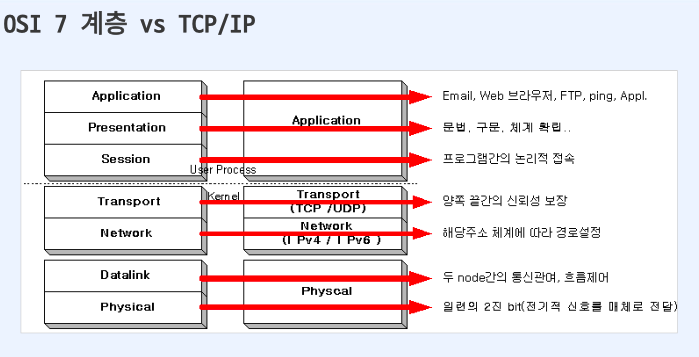

## OSI 7 계층 기초 정리

## 목차

- [OSI 7 계층 기초 정리](#osi-7-계층-기초-정리)
- [목차](#목차)
- [OSI 7 계층 이란 ?](#osi-7-계층-이란-)
- [OSI 7 VS TCP/IP](#osi-7-vs-tcpip)
- [OSI 7 Layer](#osi-7-layer)
- [1계층 물리 계층](#1계층-물리-계층)
- [2계층 데이터 링크 계층](#2계층-데이터-링크-계층)
- [3계층 네트워크 계층](#3계층-네트워크-계층)
- [4계층 전송 계층](#4계층-전송-계층)
- [5계층 세션 계층](#5계층-세션-계층)
- [6계층 표현 계층](#6계층-표현-계층)
- [7계층 응용 계층](#7계층-응용-계층)
- [각 계층 별로 사옹되는 프로토콜](#각-계층-별로-사옹되는-프로토콜)

  
## OSI 7 계층 이란 ?

* 네트워크 : 통신을 목적으로 실제 물리적인 선으로 연결되어 있거나, 무선으로 연결됨. PC나 스마트폰처럼 네트워크 송수신 주체인 종단 시스템과 종단 시스템을 연결하기 위한 규약인 프로토콜이 있다.

* OSI 7 계층: 네트워크 구성요소를 7개의 계층으로 역할을 나눈 표준 모델입니다. 각 계층별 역할을 통해 통신 규격(프로토콜)을 충족. 일부 하위계층은 하드웨어에서 구현되며 상위계층은 소프트웨어로 구현.
* TCP/IP(Transmission Control Protocol/Internet Protocol) : OSI 7 계층이 나오기 전 널리 사용되던 사실상 표준 역할. 이것 또한 계층별 역할에 따라 역할이 나뉨.

 

## OSI 7 VS TCP/IP
 

 

## OSI 7 Layer
물 - 데 - 네 - 트(transport) - 세 - 표 - 응
  

## 1계층 물리 계층 
* 물리적 매체를 통한 비트 스트림 전송에 요구되는 기능을 담당(기계적, 전기적, 전송매체)
* 물리 계층의 기능
  * 데이터 전송 : 물리계층은 비트 스트림을 전기 신호로 변환하여 전송 매체를 통해 전송한다.
  * 인코딩 : 데이터를 전송 가능한 신호로 변환하기 위해 인코딩 기술을 사용.
  * 물리적인 연결 : 물리계층은 컴퓨터와 네트워크 매체를 물리적으로 연결한다. 이는 케이블 연결, 커넥터 및 핀의 정의 등을 포함한다.
  * 전송 매체 관리 : 물리 계층은 전송 매체를 관리하고 통제하기 위한 기능을 수행한다. 예를 들어 신홍의 증폭, 감쇄, 노이즈 제거 등을 처리한다.
* 물리계층을 위한 프로토콜
  * CSMA/CD(Carrier sense Multiple Access/Collision Detection)

  

## 2계층 데이터 링크 계층
  

 

  

* 네트워크에서 물리적인 매체를 통해 직접 통신하는 기능을 담당.
* 물리 계층으로 부터 전송된 비트 스트림을 프레임단위로 분리하고, 이를 목적지로 안전하게 전달하기 위한 제어 기능 제공.
* 물리적인 주소 지정(MAC), 데이터 링크 계층은 네트워크에 연결된 장치들을 식별하기 위해 물리적인 주소를 사용.
* 데이터 링크 계층의 기능
  * 프레임 구성 : 네트워크 계층으로부터 받은 비트 스트림을 프레임 단위로 나눔.
  * 물리주소 지정 : 송신자와 수신자의 물리 주소를 헤더에 추가.
  * 흐름제어 : 송신자와 수신자 간의 데이터 흐름을 조절하여 데이터 손실이나 오버플로우를 방지. 이를 통해 수신자가 처리할 수 있는 속도에 맞춰 데이터를 전송.
  * 오류제어 : 손상 또는 손실된 프레임을 발견/재전송.
  * 접근제어 : 여러 개의 장치가 공유하는 매체에 대한 접근을 제어. 이를 통해 동시에 여러 장치가 매체를 사용할 수 있는 충돌을 방지하고, 효율적인 매체 이용을 도모.
* 데이터 링크 계층에서 사용하는 프로토콜
  * ARP(Address Resolution Protocol) : 주소를 해석하기 위한 프로토콜. 논리적인 IP주소를 물리적인 MAC주소로 바꾼다. 캐시를 통해 얻은 정보가 저장되고, 보통 20분의 수명을 가진다.
  * RARP(Reverse Address Resolution Protocol) :  역 주소 프로토콜. 저장 장치가 없는 네트워크 단말기등이 IP 주소를 얻기위해 사용한다.
  

## 3계층 네트워크 계층

  

 

  

* 패킷을 발신지-대-목적지 절달에 대한 책임을 가짐.
* 네트워크 계층의 기능
  * 논리 주소 지정: 상위 계층에서 받은 패킷에 발신자와 목적지의 논리주소를 헤더에 추가.
  * 라우팅 : 패킷이 최종 목적지에 전달될 수 있도록 경로를 지정하거나 교환.
  * 연결, 흐름, 오류 제어
* 네트워크 계층의 프로토콜
  * ICMP(Internet Control Message Protocol) : 에러 발생 시 에러 발생 원인을 알려주거나 네트워크 상태를 진단해주는 기능.
  * IGMP(Internet Group Management Protocol) : 호스트(컴퓨터) 가 멀티캐스트 그룹 구성원을 인접한 라우터에게 알리는 프로토콜.
  * IP(Internet Protocol) : 네트워크 기기에서 논리적 식별을 위한 주소.
  

## 4계층 전송 계층

  

 

  

* 전체 메시지의 프로세스 대 프로세스 전달에 대한 책임을 가짐.
* 전체 메시지가 완전하게 바른 순서로 도착하는 것을 보장.
* 전송 계층의 기능
  * 포트 주소 지정 : 네트워크 계층은 각 패킷을 정확한 컴퓨터에, 전송 계층은 해당 컴퓨터의 정확한 프로세스(프로그램)에게 전달.
  * 분할과 재조립 : 전달 가능한 세그먼트 단위로 나눔. 각 세그먼트는 순서번호를 가지며 이를 통해 재조립 또는 패킷의 손실여부 판단.
  * 연걸, 흐름, 오류 제어.
* 전송 계층의 프로토콜
  * TCP(Transmission Control Protocol)
    * 연결형 서비스로 가상 회선 방식을 제공.
    * 신뢰성을 보장하며 3-way handshaking 과정을 통해 연결.
    * 전이중(Full-Duplex), 점대점(Point to Point) 방식.
  * UDP(User Datagram Protocol)
    * 비연결형 서비스로 데이터그램 방식을 제공.
    * 신뢰성이 낮음.
    * TCP보다 속도가 빠름.
  * SCTP(Stream COntrol Transmission Protocol)
    * UDP와 TCP의 특성을 결합.
    * UDP나 TCP와 유사하며 다중 연결을 지원.
* TCP에서 사용되는 주소를 Port라고함
    * 응용프로그램 사용하기 위한 번호
    * HTTP, 등등
  

구분  | UDP                     | TCP
----|-------------------------|--------------------------------
신뢰성 | 신뢰성이 없다                 | 신뢰성이 있다
연결성 | 비연결성                    | 연결성
재전송 | 재전송없음                   | 재전송
특징  | 신뢰할 수 없지만 고속의 데이터 전송 가능 | 흐름제어로 인하여 속도는 비교적느려도 신뢰성 있는 연결

## 5계층 세션 계층
* 통신 사이의 연결이 끊기지 않게 세션을 영어 관리하는 역할

## 6계층 표현 계층
* 다양한 데이터의 포멧을 일정한 포멧으로 변환하고 압축과 암호화, 복호화 작업을 수행하는 역할

## 7계층 응용 계층
* 응용 프로그램과 사용자 사이의 인터페이스를 제공하는 역할
* 크롬, 익스플로우 등

  

## 각 계층 별로 사옹되는 프로토콜

계층 | 계층명     | 프로토콜                 | 장비             | 기능
---|---------|----------------------|----------------|----------------------------------------------
7  | 응용 계층   | DHCP, DNS, FTP, HTTP | 서비스 제공         | 사용자가 네트워크에 접근할 수 있는 계층이다.
6  | 표현 계층   | JPEG, MPEG, SMB, AFP | 이해할 수 있는 포멧 변환 | 운영체제의 한 부분으로 입력 또는 출력되는 데이터를 하나의 표현 형태로 변환한다.
5  | 세션 계층   | SSH, TLS             | 응용간의 질서 제어     | 통신 세션을 구성하는 계층으로, port연결이라고도 한다.
4  | 전송 계층   | TCP, UDP, ARP        | 게이트 웨이         | 전체 메시지 발신지 대 목적지간 제어와 에러를 관리한다.
3  | 네트워크 계층 | IP, ICMP             | 라우터            | 다중 네트워크 링크 패킷을 발신지로부터 목적지로 전달할 책임을 갖는다.
2  | 데이터 계층  | MAC, PPP             | 브리지, 스위치       | 오류 없이 한 장치에서 다른 장치로 프레임을 전달역할
1  | 물리 계층   | Ethernet RS-232C     | 허브, 리피터        | 물리적 매체를 통해 비트흐름을 전송하기 위해 요구되는 기능들의 조정.