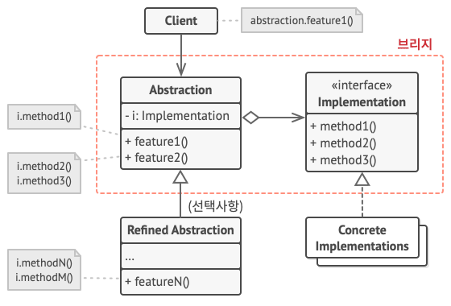

# 브릿지 패턴(Bridge Pattern)

## 브릿지 패턴이란?

- 구현부에서 추상층을 분리하여 각자 독립적으로 변형할 수 있게 하는 패턴.
- 추상적 개념과 구체적 구현을 서로 다른 두개의 인터페이스로 구현하는 디자인 패턴이다.

## 브릿지 패턴의 구조

- Abstraction
    : 기능 계층의 최상위 클래스이며 추상 인터페이스를 정의한다.
    Implementor에 대한 레퍼런스를 유지한다.
    구현 부분에 해당하는 클래스를 인스턴스를 가지고 해당 인스턴스를 통해 구현부분의 메서드를 호출한다.

- RefinedAbstraction
    : Abstraction에 의해 정의된 인터페이스를 확장한다.(extends) 기능 계층에서 새로운 부분을 확장한 클래스이다.

- Implementor
    : 구현 클래스를 위한 인터페이스를 정의한다. Abstraction의 기능을 구현하기 위한 인터페이스를 정의한다.

- ConcreteImplementor
    : Implementor 인터페이스를 구현 즉, 실제 기능을 구현한다.
