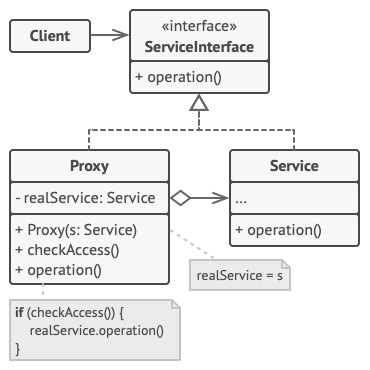

# 프록시 패턴(Proxy Pattern)

## 프록시 패턴이란?

- 실제 기능을 수행하는 객체(Real Object) 대신 가상의 객체(Proxy Object)를 사용해 로직의 흐름을 제어하는 디자인 패턴.
- 프록시 패턴을 사용하는 경우는 어떤 클래스의 객체 생성이 오래 걸리는 경우 그 일을 분업하여 Proxy 클래스에서 처리 할 수 있는
부분은 처리를 하고 처리할 수 없는 작업에 대해서만 실제 클래스의 객체를 생성하고 위임하는 방식을 취한다.
- RealSubject가 원격 시스템에서 돌아가거나 그 객체의 생성 비용이 많이 들어 실제 사용 시점에 객체를 생성하거나 실제 객체에 접근을
제한 및 제어를 해야 할 때 사용한다.

## 프록시 패턴의 구조

- ServiceInterface
    : Proxy와 Service(RealSubject)가 구현해야하는 인터페이스. 두 객체를 동일하게 다루기 위해 존재

- Proxy
    : RealSubject 와 클라이언트의 요청 사이에 존재하는 객체. ServiceInterface(Subject)를 구현함으로써 클라이언트는
    Proxy와 RealSubject의 차이를 모른다.

- Service
    : 실질적으로 요청에 대해 주된 기능을 수행하는 객체(RealSubject). Proxy 객체는 내부적으로 이 객체를 로직에 맞게 사용한다.(위임)

## 프록시 패턴의 특징

- 원래 하려던 기능을 수행하며 그 외의 부가적인 작업(로깅, 인증, 네트워크 통신 등)을 수행할 수 있다.
- 비용이 많이 드는 연산(DB쿼리, 대용량 텍스트 파일 등)을 실제로 필요한 시점에 수행할 수 있다.
- 실제 객체의 리소스가 무거운 경우, 프록시 객체에서 간단한 처리를 하거나 기본 객체를 캐싱 처리함으로써 부하를 줄일 수 있다.
- 실제 객체에 대한 수정 없이 클라이언트에서의 사용과 기본 객체 사이의 일련의 로직을 프록시 객체를 통해 넣을 수 있다.
- 프록시는 기본 객체와 요청 사이에 있기 때문에 일종의 보안 역할도 한다.
- 사용자 입장에서는 프록시 객체나 실제 객체나 사용법이 유사함으로 구조나 코드 구현이 간단하다.

## 프록시 패턴의 종류

- 원격 프록시: 원격 객체에 대한 접근 제어가 가능하다.
- 가상 프록시: 객체의 생성비용이 많이 들어 미리 생성하기 힘든 객체에 대한 접근 및 생성시점 등을 제어한다.
- 보호 프록시: 접근 권한을 제어해야하는 객체에 대한 접근을 제어한다.
- 방화벽 프록시: 네트워크 자원에 대한 접근을 제어함으로써 '나쁜' 클라이언트들로부터 보호한다.
- 스마트 레퍼런스 프록시: 주 객체가 참조될 때마다 추가 행동을 제공한다.
  - 객체 참조에 대한 선 작업, 후 작업 등
- 캐싱 프록시: 비용이 많이 드는 작업의 결과를 임시로 저장하고, 추후 여러 클라이언트에 저장된 결과를 실제 작업처리 대신 보여주고 자원을 절약한다.
- 동기화 프록시: 여러 스레드에서 주 객체에 접근하는 경우에 안전하게 작업을 처리한다.
- 복잡도 숨김 프록시: 복잡한 클래스들의 집합에 대한 접근을 제어하고 복잡도를 숨긴다.
- 지연 복사 프록시: 클라이언트에서 필요로 할 때까지 객체가 복사되는 것을 지연시킴으로써 객체의 복사를 제어한다.

