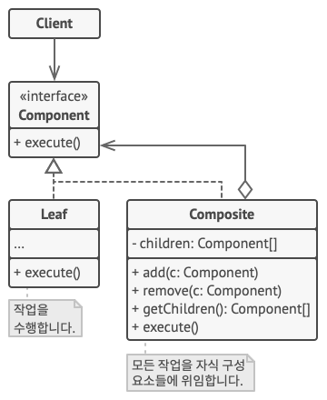

# 합성 패턴(Composite Pattern)

## 합성 패턴이란?

- 객체들의 관계를 트리 구조로 구성하여 전체-부분 계층을 표현하는 패턴.
- 여러 개의 객체들로 구성된 복합 객체와 단일 객체를 클라이언트에서 구별 없이 다루게 한다.
- 전체-부분의 관계를 갖는 객체들 사이의 관계를 정의할 때 유용하다.
- 클라이언트는 전체와 부분을 구분하지 않고 동일한 인터페이스를 사용할 수 있다.

## 합성 패턴의 구조

- Component
    : Leaf와 Composite를 같은 타임으로 취급하기 위한 인터페이스.
    Leaf 클래스와 전체에 해당하는 Composite 클래스에 공통 인터페이스를 정의한다.

- Leaf
    : 구체적인 부분 클래스로 단일 객체를 표현한다. 트리구조로 따지면 가장 밑단에 존재하는 나뭇잎이다.

- Composite
    : 복합 객체 그룹을 표현할 클래스로 전체 클래스이다. 자식으로 여러개의 Component 타입 멤버를 수용할 수 있도록 구현되어야 한다.

## 합성 패턴의 적용

- 트리와 같은 객체 구조를 구현해야 할 때 사용.
- 클라이언트 코드가 단순 요소들과 복합 요소들을 모두 균일하게 처리하고 싶을 때 사용.