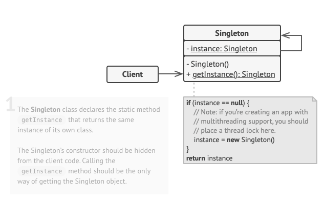

# 싱글턴 패턴(Singleton Pattern)

## 싱글턴 패턴이란?

- 인스턴스를 하나만 만들어 사용하기 위한 패턴.
- 커넥션 풀, 스레드 풀, 디바이스 설정 객체 등의 경우 인스턴스를 여러 개 만들게 되면 자원을 낭비하게 되거나 버그를 
발생시킬 수 있으므로 오직 하나만 생성하고 그 인스턴스를 사용하도록 하는 것이 목적이다.
- 인스턴스가 하나만 있으니 이 인스턴스에 대한 전역 접근 지점을 제공하는 패턴이다.

## 싱글턴 패턴의 구조

## 싱글턴 패턴의 이점

- 인스턴스를 단 하나만 사용하니 메모리 측면에서 이점이 있다.
- 싱글턴 인스턴스가 전역으로 사용되는 인스턴스이기 때문에 다른 클래스의 인스턴스들이 접근하여 사용할 수 있다.
- 전

## 싱글턴 패턴의 문제점

- 싱글턴 패턴은 한 번에 두 가지 문제를 동시에 해결함으로써 단일 책임 원칙(SRP)을 위반한다.
- 멀티 스레드 환경에서 위험하다.
- 클래스 로더마다 서로 다른 네임스페이스를 정의하기에 클래스 로더가 2개 이상이면 같은 클래스를 여러 번 로딩할 수 있다.
- 리플렉션, 직렬화, 역직렬화도 싱글턴에서 문제가 될 수 있다.

## 싱글턴 패턴은 안티 패턴?

1. private 생성자를 갖고 있어 상속이 불가능하다.
    : 싱글턴은 자신만이 객체를 생성할 수 있도록 생성자를 private으로 제한한다. 하지만 상속을 통해 다형성을 적용하기 위해서는
    기본생성자가 필요하므로 객체지향의 장점을 적용할 수 없다. 
    또한 싱글턴을 구현하기 위해선 객체지향적이지 못한 static 필드와 static 메소드를 사용해야 한다.

2. 테스트하기 힘들다.
    : 싱글톤은 생성 방식이 제한적이기 때문에 Mock 객체로 대체하기가 어려우며, 동적으로 객체를 주입하기도 힘들다.
    테스트 코드를 작성할 수 없다는 것은 큰 단점이 된다.

3. 서버 환경에서는 싱글턴이 1개만 생성됨을 보장하지 못한다.
    : 서버에서 클래스 로더를 어떻게 구성하느냐에 따라 싱글턴 클래스임에도 불구하고 다른 네임스페이스를 정의하는 클래스 로더들 때문에
    1개 이상의 객체가 만들어 질 수 있다. 또한 여러 개의 JVM에 분산돼서 설치되는 경우에도 독립적으로 객체가 생성된다.

4. 전역 상태를 만들 수 있기 때문에 바람직하지 못하다.
    : 싱글톤의 스태틱 메소드를 이용하면 언제든지 해당 객체를 사용할 수 있고, 전역 상태(Global State)로 사용되기 쉽다.
    아무나 객체에 자유롭게 접근하고 수정하며 공유되는 전역 상태는 객체지향 프로그래밍에서 권장되지 않는다.