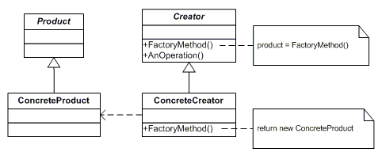

# 팩토리 메서드 패턴(Factory Method Pattern)

## 팩토리 메서드 패턴이란?

- 팩토리 메서드 패턴은 객체를 생성하기 위해 인터페이스를 정의하지만 어떤 클래스의 인스턴스를 생성할 지에 대한 결정은
서브클래스가 내리도록 할 때 유용하게 사용된다.
- 어떤 클래스가 자신이 생성해야 하는 객체의 클래스를 예측할 수 없을때 사용한다.
- 하위 클래스에서 팩토리 메서드를 오버라이딩해서 객체를 반환하게 하는 패턴.

## 팩토리 메서드 패턴 구조

- Product: 팩토리 메서드가 생성하는 객체의 인터페이스
- ConcreteProduct: Product 클래스에 정의된 인터페이스를 실제로 구현하는 클래스
- Creator: Product 타입의 객체를 반환하는 팩토리 메서드를 선언하는 클래스
- ConcreteCreator: 팩토리 메서드를 재정의하여 ConcreteProduct의 인스턴스를 반환

## 팩토리 메소드 패턴의 구현 방법

- Creator를 추상 클래스로 정의하고, 팩토리 메서드는 abstract로 선언하는 방법.
- Creator가 구체 클래스이고, 팩토리 메서드의 기본 구현을 제공하는 방법.

## 구현시 고려할 점

- 팩토리 메서드에 잘못된 인자가 들어올 경우의 런타임 에러 처리에 대해 고민할 것.
- Enum 등을 사용하는 것도 고려할 필요가 있다.

## 팩토리 메서드의 장점

- 팩토리 메서드 패턴은 응용프로그램에 국한된 클래스가 코드에 종속되지 않도록 해준다.
- 응용프로그램은 Product 클래스에 정의된 인터페이스와만 동작하도록 코드가 만들어지기 때문에, 사용자가 정의한 어떤 ConcreteProduct
클래스가 와도 동작할 수 있다.
- SRP
- OCP

## 팩토리 메서드의 단점

- 패턴 구현에 의한 코드가 복잡해질 수 있다.

