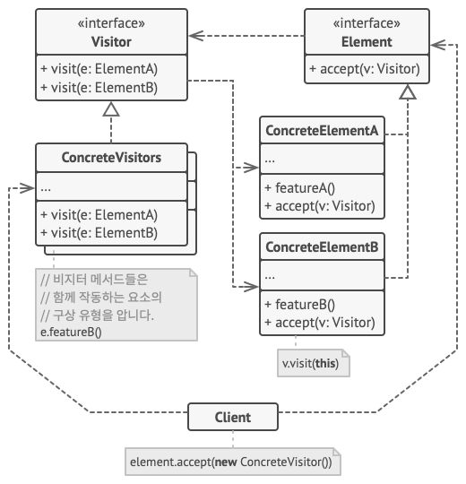

# 방문자 패턴(Visitor Pattern)

## 방문자 패턴이란?

- 실제 로직을 가지고 있는 객체(Visitor)가 로직을 적용할 객체(Element)를 방문하면서 실행하는 패턴.
- 로직과 구조를 분리하는 패턴.
- 로직과 구조가 분리되면 구조를 수정하지 않고도 새로운 동작을 기존 객체 구조에 추가할 수 있다.
- 비슷한 종류의 객체들을 가진 그룹에서 작업을 수행해야 할 때 주로 사용되는 패턴.

## 방문자 패턴의 구조

- Visitor
    : 명령을 수행하기 위해 필요한 메소드를 정의하는 인터페이스.

- ConcreteVisitor
    : 명령을 수행하는 메소드를 구현.

- Element
    : Visit을 사용할 수 있는지 확인하는 accept 메소드를 정의하는 인터페이스

- ConcreteElement
    : Visitable에서 정의된 accept 메소드를 구현하며 Visitor 객체는 이 객체를 통하여 명령이 전달됨.

## 방문자 패턴의 적용

- 복잡한 객체 구조(객체 트리 등)의 모든 요소에 대해 작업을 수행해야 할 때 사용.
- 행동이 클래스 계층구조의 일부 클래스들에서만 의미가 있고 다른 클래스들에서는 의미가 없을 때 사용.