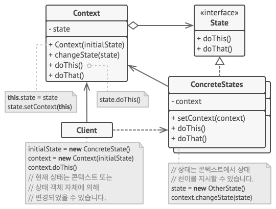

# 상태 패턴(State Pattern)

## 상태 패턴이란?

- 객체 내부의 상태에 따라 동작을 변경해야할 때 사용하는 디자인 패턴.
- 객체의 특정 상태를 클래스로 선언하고 클래스에서는 해당 상태에서 할 수 있는 행위들을 메서드로 정의.
- 각 상태 클래스들을 인터페이스로 캡슐화하여 클라이언트에서 인터페이스를 호출.

## 상태 패턴의 구조

- Context
    : 객체의 상태를 정의하는 데 사용되는 메소드를 정의하는 인터페이스.

- State
    : 상태에 따른 동작을 정의하는 인터페이스.

- ConcreteState
    : State에서 정의된 메소드를 구현하는 클래스.

## 상태 패턴의 적용

- 현재 상태에 따라 다르게 행동하는 객체가 있을 때, 상태들의 수가 많을 때, 상태별 코드가 자주 변경될 때 사용.
