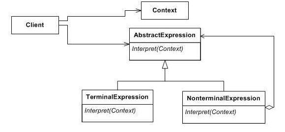

# 인터프리터 패턴(Interpreter Pattern)

## 인터프리터 패턴이란?

- 언어 문법이나 표현을 평가할 수 있는 방법을 제공한다.
- 특정 컨텍스트를 해석하도록 지시하는 표현 인터페이스를 구현하는 것을 포함한다.
- SQL 구문 분석, 기호 처리 엔진 등에서 사용된다.

## 인터프리터 패턴의 구조

- AbstractExpression
    : interpret()을 정의.

- TerminalExpression
    : interpret()을 구현.

- NonTerminalExpression
    : Non-Terminal의 interpret()을 구현.

- Context
    : String 표현식이여야 하며 인터프리터에 보내는 정보.

- Client
    : interpret()을 호출.