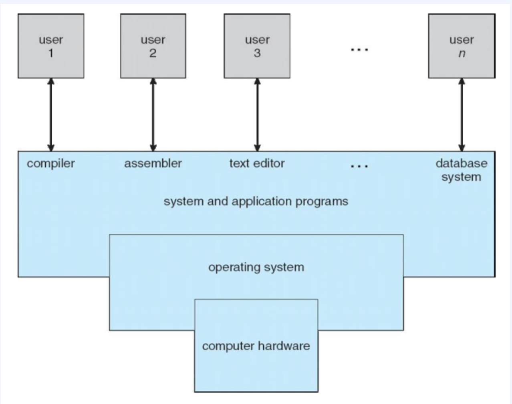
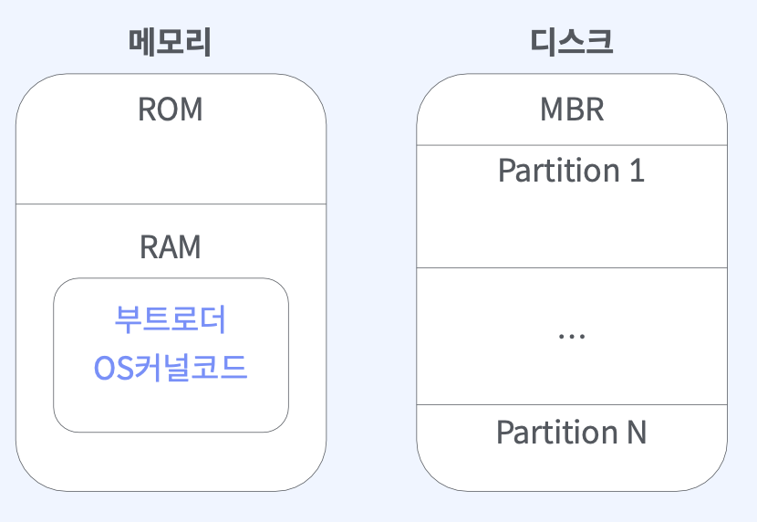
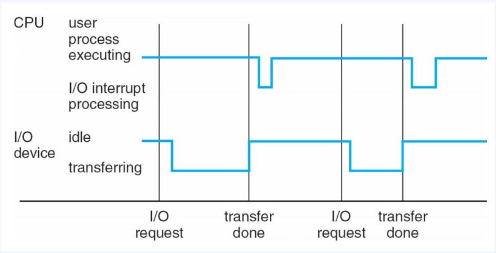
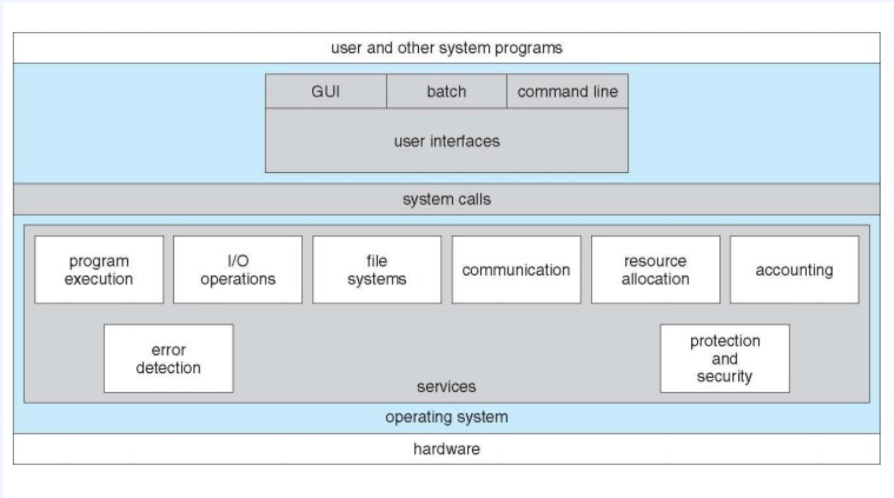
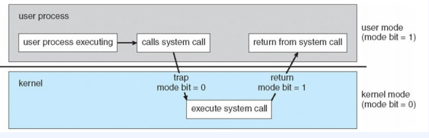

# 운영체제 개요

## 목차
- [운영체제 개요](#운영체제-개요)
  - [목차](#목차)
  - [컴퓨터 시스템의 기본 구성](#컴퓨터-시스템의-기본-구성)
  - [컴퓨터 시스템 구성도](#컴퓨터-시스템-구성도)
  - [운영체제의 목적](#운영체제의-목적)
  - [운영체제가 하는 일](#운영체제가-하는-일)
  - [부팅](#부팅)
  - [부팅 과정](#부팅-과정)
  - [인터럽트](#인터럽트)
  - [시스템 콜](#시스템-콜)

## 컴퓨터 시스템의 기본 구성
* 하드웨어(CPU, 메모리, I/O 장치)
* 운영체제(WindowOS, MacOS..)
* 응용 프로그램
* 사용자(사람, 기계, 컴퓨터)
  

## 컴퓨터 시스템 구성도
 

 

 

## 운영체제의 목적
* 컴퓨터 시스템을 효율적으로 관리하고, 사용자 및 응용 프로그램이 하드웨어와 상호작용 할 수 있도록 지원하는 것.
* 유저 프로그램을 구동하여 유저의 문제 해결을 도와주는 것.
  

## 운영체제가 하는 일
* 자원관리(Resource ManageMent): 컴퓨터 시스템의 자원을 효율적으로 관리. 컴퓨터 구성요소에게 자원을 할당하고 관리하여 응용프로그램이 원할하게 실행될 수 있도록 함. 또한 다중 작업 환경에서 여러 응용 프로그램이 동시에 실행되는 것을 지원하고, 자원의 충돌과 경쟁을 관리하여 안정적인 시스템 운영을 제공
* 프로세스 관리(Process Management): 프로세스의 생성, 종료, 스케줄링, 동기화, 통신 등을 관리.
* 파일 시스템 관리(File System Management): 파일 시스템을 관리하여 파일의 생성, 수정, 삭제, 접근(권한) 등을 관리.
* 입출력 관리(I/O Management): 입출력 장치의 제어와 관리.
* 사용자 인터페이스(User Interface): 사용자와 컴퓨터 시스템 간의 상호작용을 위한 인터페이스 제공. CLI,GUI,Touch Screen 등.
  

## 부팅
* 부트스트랩(Bootstrap, 부팅)은 컴퓨터를 시작하고 운영체제를 메모리에 로드하여 실행하는 과정.
  

## 부팅 과정
1. 전원 공급: 전원 버튼을 누르거나 전원 연결을 통해 메인보드에 전력 공급.
2. 기본 입력 출력 시스템(Basic Input/Output System, BIOS) 시작: ROM 또느 EEPROM에 저장된 BIOS 루틴이 시작.
3. POST(Power-On Self Test): BIOS는 셀프테스트를 통해 컴퓨터의 기본 하드웨어를 테스트. 이 테스트는 주 메모리, 그래픽 카드, 키보드, 마우스 등의 주요 하드웨어 구성 요소를 점검하고 정상 작동 여부를 확인. 만약 실패할 경우 블루스크린 혹은 비프음과 같이 사용자에게 전달.
4. 부트 로더 실행: 셀프테스트가 완료되면, BIOS는 부트 로더를 찾아 실행. 부트 로더는 보통 하드 드라이브에 부트 섹터에 위치하며 주로 MBR(Master Boot Record)라고 불리는 특정 영역에 저장.
5. 운영체제 로드: 부트 로더는 운영체제의 위치를 찾아 해당 이미지를 메모리에 로드. 이후 운영체제의 실행 코드가 시작되고 운영체제가 초기화되고 사용자에게 접근 가능한 상태가 됨.
  

 

  

## 인터럽트
- 인터럽트는 컴퓨터 시스템에서 발생하는 이벤트로, CPU가 프로그램을 구동 중일 때 입출력이나 예외 상황이 발생하여 처리가 필요한 경우에 CPU에 신호를 보내는 것. 인터럽트는 하드웨어나 소프트웨어에서 발생할 수 있으며, 주로 다음과 같은 상황에서 사용됨.
    - 하드웨어 인터럽트: 하드웨어가 발생시키는 인터럽트로 입출력 장치의 데이터 전송 완료, 타이머의 경과, 외부 신호 등. CPU외의 하드웨어가 CPU에게 신호를 보내야 할 경우.
    - 소프트웨어 인터럽트: 소프트웨어가 의도적으로 발생시키는 인터럽트로, 주로 예외 상황이나 특정한 시스템 콜을 처리하기 위해 사용.
- 인터럽트 발생시 CPU가 수행중인 작업 중지 -> 지정된 위치로 실행위치 변경 -> 인터럽트 수행 -> 종료시 중단되었던 컴퓨팅 재개.
- 인터럽트 타임라인.

 

  
  
## 시스템 콜
 
    

    
    

 

* 시스템 콜(System Call)은 응용 프로그램이 운영체제의 서비스를 사용하기 위해 호출하는 인터페이스. 커널 영역의 기능을 사용자 모드가 사용 가능하게 하는 하나의 수단. 프로세스가 하드웨어에 접근해서 필요한 기능을 사용할 수 있게 함.
* 듀얼 모드: 컴퓨터 시스템에서 운영체제와 응용 프로그램이 하드웨어 자원을 안전하게 공유하고 관리하기 위한 모두.  사용자 모드와 커널 모드 두가지 모드.
    * 사용자 모드: 응용 프로그램이 실행되는 모드로, 일반적인 응용 프로그램 코드가 실행됨. 사용자 모드에서는 특정한 하드웨어 자원에 직접 접근할 수 없고, 운영체제가 제공하는 서비스를 통해 자원에 접근해야 함.
    * 커널 모드: 운영체제의 핵심 컴포넌트인 커널이 실행되는 모드로, 최고의 권한과 컴퓨터 시스템의 모든 자원에 접근할 수 있는 모드. 
    * 듀얼 모드는 사용자 모드와 커널 모드를 구분하여 운영체제와 응용 프로그램 간에 보안과 안정성을 유지하기 위한 것. 
    

    
    

* 시스템 콜 유형
    * 프로세스 제어
    * 파일 관리
    * 장치 관리
    * 정보 유지
    * 통신
    * 보호