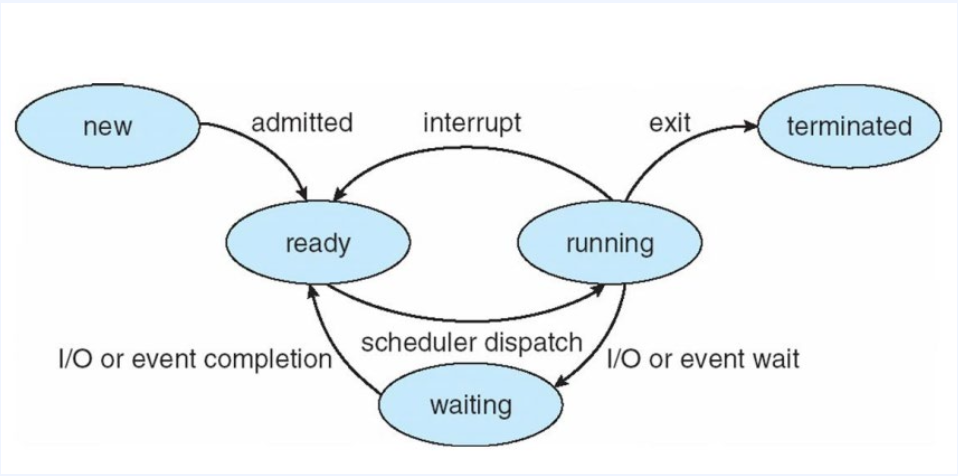
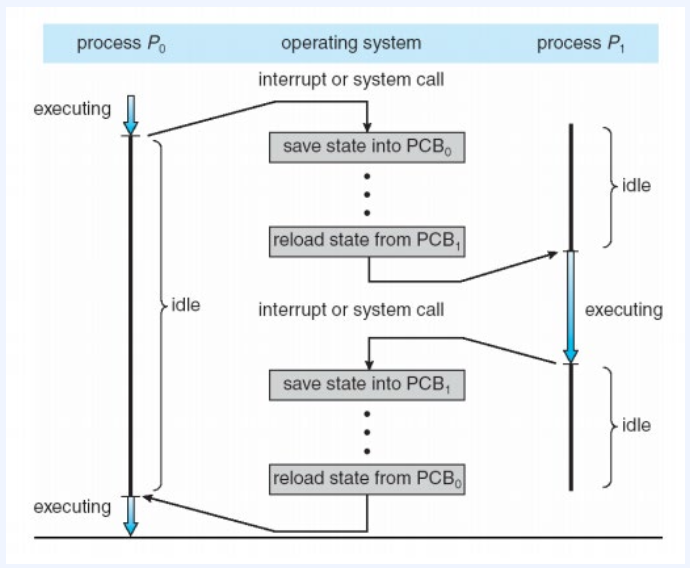
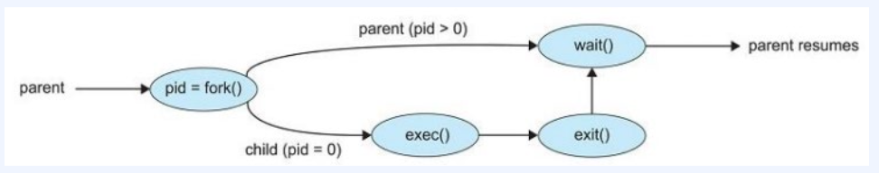

# 프로세스

## 목차
- [프로세스](#프로세스)
  - [목차](#목차)
  - [프로세스란?](#프로세스란)
  - [메모리 상에서의 프로세스](#메모리-상에서의-프로세스)
  - [프로세스 상태](#프로세스-상태)
  - [프로세스 제어 블록(PCB)](#프로세스-제어-블록pcb)
  - [PCB정보](#pcb정보)
  - [컨텍스트 스위치(Context Switch)](#컨텍스트-스위치context-switch)
  - [컨텍스트 스위치 과정](#컨텍스트-스위치-과정)
  - [프로세스 연산(생성,종료)](#프로세스-연산생성종료)
  - [fork(),exec()](#forkexec)
  - [프로세스 종료](#프로세스-종료)

## 프로세스란?
- 프로세스(Process)는 컴퓨터에서 실행 중인 프로그램.
- 운영체제의 관리를 받으며, 프로그램이 실행되기 위해 필요한 코드, 데이터, 메모리, 파일 등의 자원을 포함.
- 프로세스는 독립적으로 실행, 각각의 프로세스는 독립된 가상 주소 공간을 할당받고, CPU 시간을 할당받아 실행.
<br><br>

## 메모리 상에서의 프로세스
<br>
<p align="center">
 
</p>

1. 텍스트 섹션(Code Section) : 프로세스의 텍스트 세션은 프로그램의 실행 코드가 저장되는 영역. 실행 가능한 명령어들이 저장되어 있으며, 일련의 명령어들이 순차적으로 실행.
2. 데이터 섹션(Data Section) : 데이터 섹션은 전역 변수, 정적 변수, 상수 등 프로그램의 데이터 요소들이 저장되는 영역.
3. 힙 섹션(Heap Section) : 동적으로 할당되는 메모리 공간. 프로세스 실행 중에 동적으로 메모리를 할당하거나 해제할 수 있는 영역으로, 동적으로 생성되는 데이터 구조나 객체들이 저장. 프로세스의 실행 중에 크기가 동적으로 변경될 수 있음.
4. 스택 세션(Stack Section) : 프로세스의 지역 변수, 함수 호출 및 복귀 주소 등을 저장하는 영역. 함수 호출 시 생성되는 지역 변수와 함수의 실행 정보를 저장. 스택의 크기는 프로세스 실행 시에 정적으로 할당되며, 함수 호출과 반환에 따라 동적으로 변경됨.
<br><br>

## 프로세스 상태
상태        | 설명     |
-----------|---------|
새로운(New)  | 프로세스가 생성되었지만, 아직 실행되기 전의 상태. |
실행(Running)  | CPU를 할당받아 명령어를 실행하고 있는 상태.  |
대기(Waiting)  | 프로세스가 어떤 이벤트(입출력 완료, 시그널 수신 등)를 기다리며 실행을 일시 중단한 상태.  | 
준비완료(Ready)  | 실행을 위해 CPU를 할당받기를 기다리는 상태.| 
종료(Terminated)  | 프로세스의 실행이 완료되거나 강제로 종료된 상태. 자원과 메모리가 해제되고 OS에 의해 정리.|
<p align="center">
 
</p>
<br><br>

## 프로세스 제어 블록(PCB)
- 프로세스 제어 블록(Process Control Block, PCB)은 운영체제가 각 프로세스를 관리하기 위해 유지하는 데이터 구조.
- PCB는 각 프로세스에 대한 정보를 저장하고, 프로세스의 상태를 추적하고 조각하는 데 사용.
- 각 프로세스 마다 하나의 PCB가 할당되며, 운영체제는 PCB를 참조하여 프로세스의 실행과 관련된 작업을 수행.
- 프로세스가 종료되면 해당 PCB를 해제하여 재사용 가능한 상태로 만듬.
<br><br>

## PCB정보
정보        | 설명     |
-----------|---------|
프로세스 식별자(PID)  | 각 프로세스를 고유하게 식별하는 식별자. |
프로세스 상태(Process State)  | 프로세스의 현재 상태.(Ready, Running, Waiting 등)  |
프로그램 카운터(Program Counter,PC)  | 다음에 실행될 명령어의 주소를 가리킴. 프로세스가 중단되었다가 다시 실행될 때 이 주소로 돌아감. | 
레지스터 정보 | 프로세스의 레지스터 상태. 실행 중인 프로세스의 레지스터 값(범용 레지스터, 스택 포인터, 상태 레지스터 등)을 저장.
프로세스 우선순위(Priority)  | 프로세스에 할당된 우선순위. 우선순위 스케줄링 알고리즘에서 사용됨.| 
자원 할당 정보  | 프로세스가 사용하는 자원에 대한 정보. 할당된 메모리 공간, 열린 파일, 입출력 장치 등.|
계정 및 스케줄링 정보 | 프로세스의 계정 정보(사용자ID, 그룹ID 등)와 스케줄링 관련 정보(실행 시간, 대기 시간 등).
<br><br>

## 컨텍스트 스위치(Context Switch)
- 현재 실행 중인 프로세스에서 다음에 실행할 프로세스로 제어를 전환하는 작업.
- 컨텍스트(Context)는 프로세스의 상태 정보를 포함하는 것으로 CPU 레지스터의 값, 프로세스 상태, 메모리 관리 정보 등을 포함.
- 컨텍스트 스위치는 현재 실행 중인 프로세스의 컨텍스트를 저장하고, 다음에 실행할 프로세스의 컨텍스트를 복원하는 작업을 수행.
- 컨텍스트 스위치가 진행될 동안의 시스템은 아무런 유용한 일을 하지 못하기에 소요 시간은 순수한 오버헤드. 그렇기에 효율적인 컨텍스트 스위치 관리는 운영체제의 성능 최적화에 중요한 역할을 함.
<br><br>

## 컨텍스트 스위치 과정
<br>
<p align="center">
 
</p>
<br><br>

1. Interrupt or System Call 발생.
2. 현재 실행중인 프로세스의 상태 저장.
3. 다음에 실행할 프로세스의 상태 복원.
4. 제어 전환.
<br><br>

## 프로세스 연산(생성,종료)
* 프로세스는 실행되는 동안 여러 개의 새로운 프로세스 들을 생성함.
* 프로세스를 생성하는 주체는 부모 프로세스, 새로운 프로세스는 자식 프로세스라고 함.
* 대부분의 운영체제는 고유의 프로세스 식별자(PID)를 사용하여 프로세스를 구분.
* 프로세스가 자식 프로세스를 생성할 때
    * 자식 프로세스는 운영체제에게 자원을 직접 얻을 수 있음.
    * 부모 프로세스가 가진 자원의 부분 집합만을 사용하도록 제한할 수 있음.
* 프로세스가 새로운 프로세스를 생성할 때
    * 부모 프로세스는 자식 프로세스와 동시에 구동.
    * 부모 프로세스는 자식 프로세스 전부/일부가 종료될 때 까지 대기.
<br><br>

## fork(),exec()
```C
#include <sys/type.h>
#include <stdio.h>
#include <unistd.h>

int main(){
    pid_t pid;

    pid = fork();
    if(pid < 0){
        fprintf(stderr, "Fork Failed");
        return 1;
    }else if (pid == 0){
        execlp("/bin/ls","ls",NULL);
    }else{
        wait(NULL);
        printf("Child Complete");
    }
    return 0;
}
```
* 자식 프로세스에게 보이는 pid는 0.
* 부모 프로세스에게 보이는 pid 값은 0보다 큰 정수값.
* 자식 프로세스는 리소스 권한, 스케줄링 속성을 부모 프로세스로부터 상속.
* 부모는 wait() 시스템 콜로 자식 프로세스가 종료되기를 대기.
* 자식 프로세스 종료 후 부모는 wait()으로부터 프로세스를 재개하여 exit()으로 종료.
<br>
<p align="center">
 
</p>
<br><br>

## 프로세스 종료
* 최종 실행이 종료된 뒤 exit()을 통해 운영체제에 삭제 요청.
    * 대기중인 부모 프로세스에게 상태 값을 리턴.
    * 운영체제에 의해 모든 프로세스의 자원들은 할당 해제.
* 부모 프로세스가 자식 프로세스를 종료 시키는 경우(abort())
    * 자식이 할당된 자원의 사용량을 초과하는 경우.
    * 자식 task가 더 이상 필요하지 않은 경우.
    * 부모가 종료되었고, 자식은 종료되지 않았을때.
* 좀비 프로세스(zombie process)
    * 종료되었지만 부모 프로세스가 아직 wait() 콜을 하지 않은 프로세스.
    * 운영체제의 프로세스 테이블에 존재하지만, 실행 중이지 않으며 더 이상 어떤 작업도 수행하지 않는 상태.
* 고아 프로세스(orphan process)
    * 부모 프로세스가 wait()을 콜하는 대신 종료하게되면 자식은 고아 프로세스가 됨.
    * Linux, UNIX 계열의 운영체제는 고아 프로세스의 새로운 부모 프로세스로 "init"프로세스를 지정하여 문제 해결.