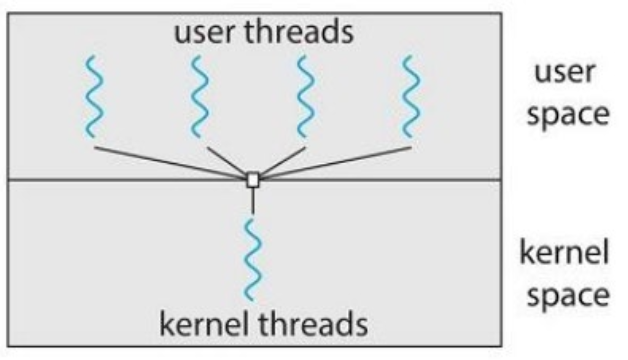
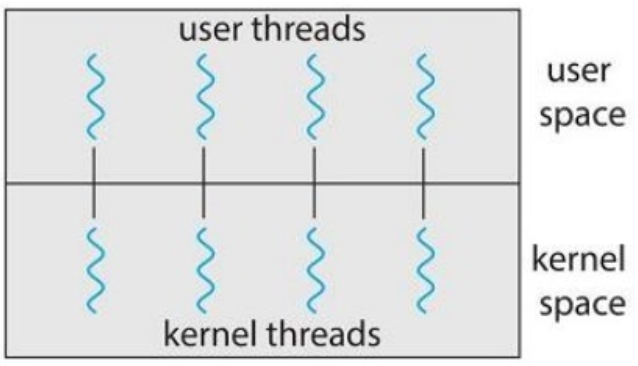
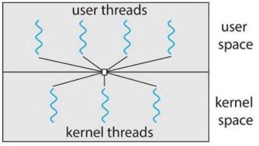
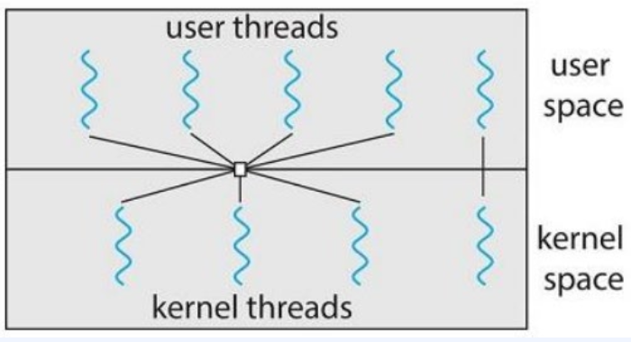

# 스레드

## 목차
- [스레드](#스레드)
  - [목차](#목차)
  - [스레드란?](#스레드란)
  - [스레드와 프로세스의 차이](#스레드와-프로세스의-차이)
  - [단일 스레드](#단일-스레드)
  - [멀티 스레드](#멀티-스레드)
  - [스레드의 실행과 관리를 담당하는 주체 (User, Kernel)](#스레드의-실행과-관리를-담당하는-주체-user-kernel)
  - [멀티 스레딩 모델](#멀티-스레딩-모델)
  - [스레드 풀](#스레드-풀)

## 스레드란?
* CPU 활용의 기본 단위.
* 프로세스 내에서 프로그램 명령을 실행하는 기본 단위.
* 프로세스 내에서 각각 독립적인 작업을 수행.
* 스레드ID, 프로그램 카운터, 레지스터 집합, 스택으로 구성
* 같은 프로세스에 속한 다른 스레드와 코드, 데이터 섹션, open files 등의 운영체제 자원을 공유.
  

## 스레드와 프로세스의 차이
* 스레드는 프로세스 내에서 실행되는 실행 단위. 스레드는 프로세스의 자원을 공유하면서 동시에 실행될 수 있음.
* 프로세스는 실행 중인 프로그램. 프로세스는 메모리 공간, 파일, 디바이스, CPU 시간 등의 시스템 리소스를 할당받음.
  

## 단일 스레드
* 프로그램이 하나의 실행 스레드만을 가지는 모델.
* 간단한 프로그램이나 작업 등에 사용.
* 순차적인 계산, 파일 읽기/쓰기, 단일 사용자 인터페이스 등의 작업에 적합.
* 장점:
    * 자원을 공용화 하지 않으므로, 고용 자원 접근 통제 불필요.
    * Context Switch 작업 불필요
* 단점:
    * 다수개의 CPU활용이 불가.
  

## 멀티 스레드
* 프로그램을 다수의 실행 단위로 나누어 실행.
* 각각의 스레드가 고유의 레지스터와 스택으로 표현.
* 각 스레드는 독립적으로 실행, 프로세스의 자원을 공유하면서 작업을 처리.
* 장점:
  * 일부가 차단되거나 장시간 작업 수행시에도 계속해서 실행 가능.
  * 프로세스의 자원과 상태를 공유. 효율적인 운영.
  * 자신이 속한 프로세스의 자원을 공유하기 때문에 스레드를 만들고 context switch를 진행하는 것이 더 경제적.
  * 다수개의 코어에서 병렬로 프로세스 실행.
* 단점:
  * 여러 스레드가 공유된 자원에 접근하므로 동기화 문제와 경쟁 상태가 발생할 수 있음.
  * 스레드간 context switch가 필요. 오버헤드가 발생.

## 스레드의 실행과 관리를 담당하는 주체 (User, Kernel)
1. 유저 스레드:
   * 유저 스레드는 사용자 수준(User Level)에서 관리되는 스레드.
   * OS가 아닌 사용자 프로세스 내에서 관리.
   * 사용자가 직접 스레드를 생성하고 스케줄링하며, 스레드 관리에 필요한 자원은 사용자 프로세스의 자원으로부터 제공받음.
   * 운영 체제의 개입 없이 동작하기 때문에 유연성과 빠른 스레드 전환 속도를 가짐.
2. 커널 스레드:
   * 운영 체제 커널 수준에서 관리되는 스레드.
   * 운영 체제가 제공하는 스레드 관련 자원과 기능을 활용하여 스레드를 스케줄링하고 동기화할 수 있음.
   * 커널 모드로의 전환은 프로세스에서 한 스레드에서 다른 스레드로 제어 전환이 필요.
   * 유저 스레드에 비해 느림.
  

## 멀티 스레딩 모델
   1. 다대일 모델
      * 다수의 유저 스레드가 하나의 커널 스레드와 맵핑.
      * 유저 스레드를 사용자 수준에서 관리하며, 하나의 커널 스레드에 의해 스케줄링됨.
      * 한 번에 하나의 스레드만 커널에 접근할 수 있으므로 멀티 스레드는 멀티코어 시스템에서 병렬로 실행할 수 없음.
        

            
        

   2. 일대일 모델
        * 각각의 유저 스레드를 커널 스레드와 맵핑.
        * 모든 스레드가 운영 체제에서 독립적으로 관리.
        * 커널 스레드의 동작에 따라 안정적인 동작과 동시성을 보장.
        * 스레드 생성과 전환에 대한 비용이 크기 때문에 성능 저하 발생 이슈.
        * 사용자 수준 스레드 생성시에도 커널 스레드 생성이 필요하다는 단점.
            

                
            

   3. 다대다 모델
        * 가장 일반적인 멀티 스레딩 모델 중 하나.
        * 많은 유저 레벨 스레드를 더 작거나 같은 수의 스레드로 다중화.
        * 커널 스레드 수는 응용 프로그램이나 특정 기계로부터 특정되어짐.
        * 개발자는 필요한 만큼 많은 유저 스레드 생성 가능.
        * 스레드가 봉쇄형 시스템 호출발생시에도 커널은 다른 스레드 수행을 스케쥴 할 수 있음.
            

                
            

   4. 2단계 모델
        * 많은 유저 레벨 스레드를 더 작거나 같은 수의 스레드로 다중화.
        * 또한 한 유저 스레드가 하나의 커널 스레드에만 맵핑되는 것을 허용.
        * 유저 수준에서의 경량한 스레드 관리와 커널 수준에서의 강력한 스레드 제어를 동시에 활용할 수 있음.
            

                
            

  

## 스레드 풀
* 지정된 개수의 스레드를 미리 생성해두고 필요시 꺼내어 쓰는 방식.
* 요청이 폭증해도 성능을 유지.
* 대량 작업 처리에서 반드시 고려 필요.
* 장점:
  * 미리 생성된 스레드를 재사용하여 스레드 생성 및 제거에 따른 오버헤드를 줄임.
  * 너무 많은 스레드를 생성하여 자원을 낭비하는 것을 방지하고, 스레드 풀의 크기를 조절하여 시스템의 부하를 제어할 수 있음.
* 단점:
  * 미리 설정된 개수의 스레드를 생성하므로 과다 생성시 메모리 측면에서 낭비 발생 가능성이 있음.
  * 작업의 수가 스레드의 수를 초과하는 경우에는 작업 대기가 발생.
  * 여러 스레드가 동시에 작업 큐에 접근하여 작업을 가져오는 경우, 동기화 문제가 발생할 수 있음.
  * 스레드 생성 및 관리를 위해 추가적인 오버헤드 발생.
  